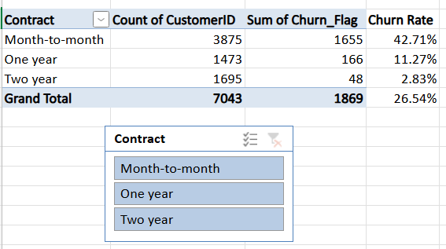
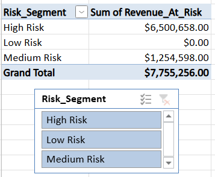
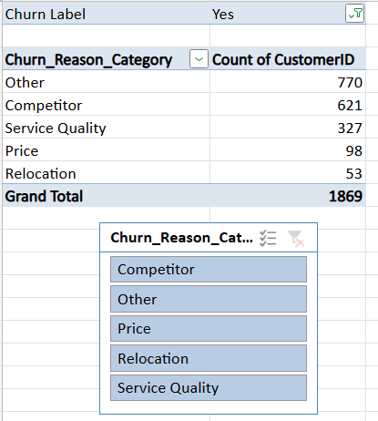
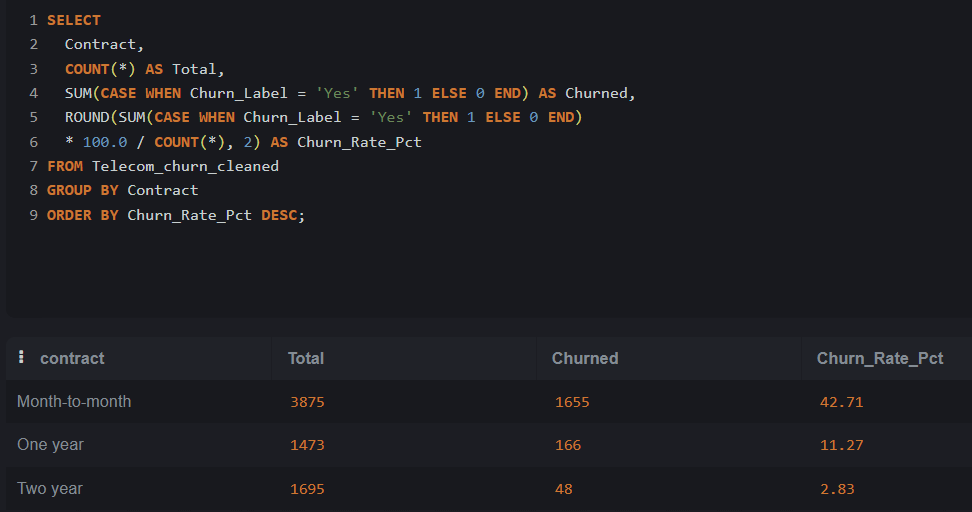
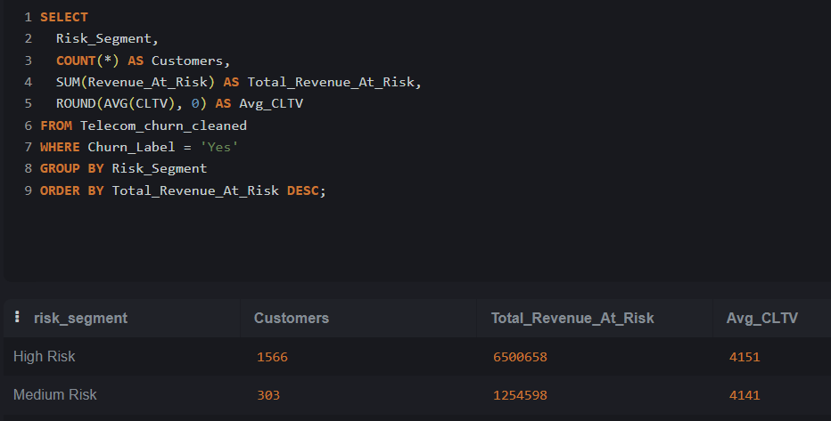
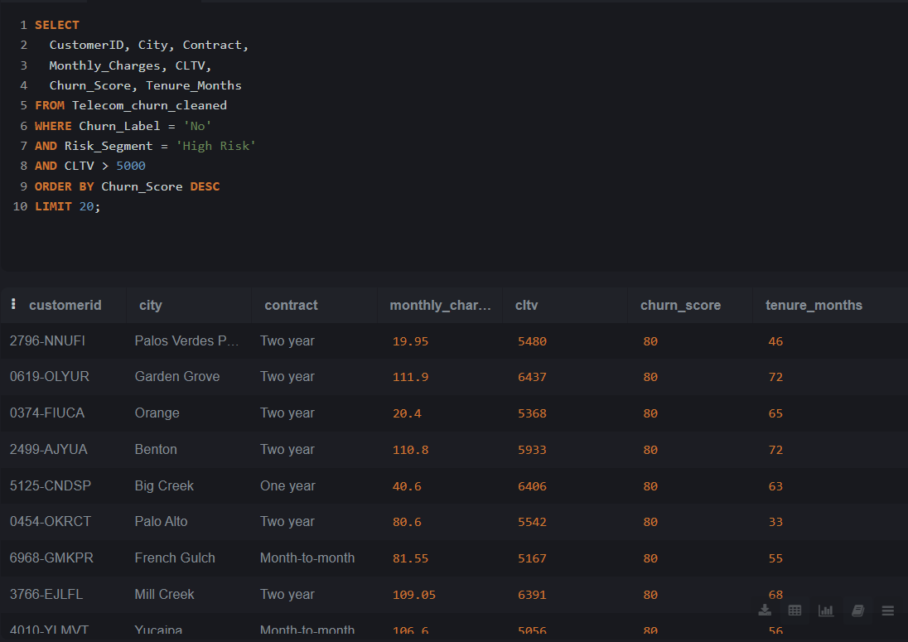
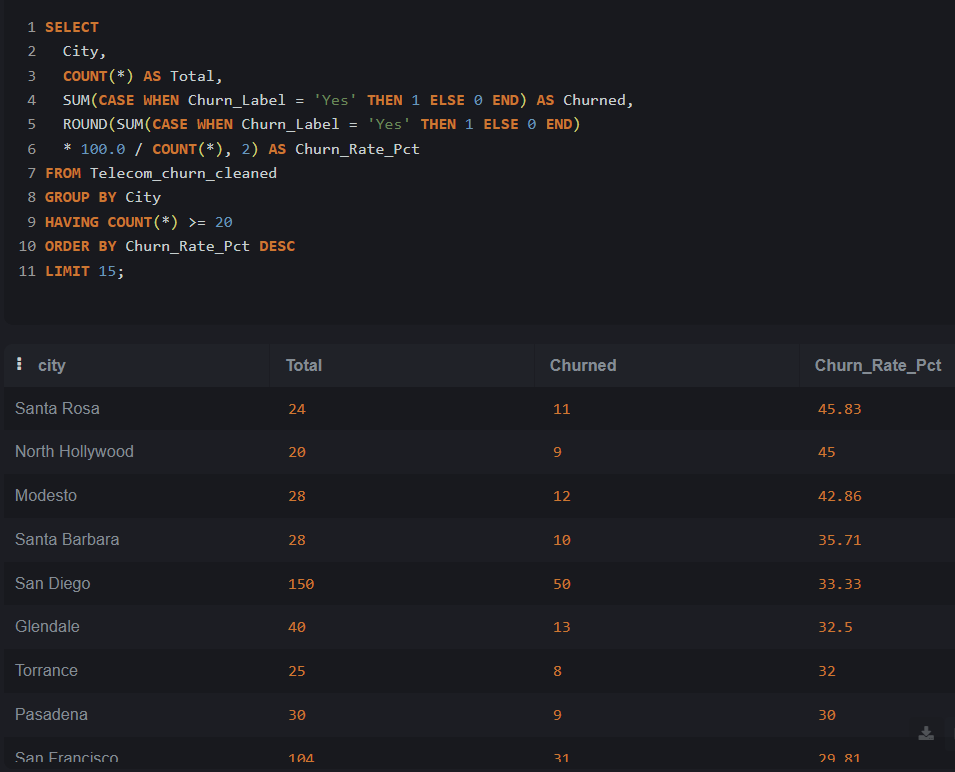
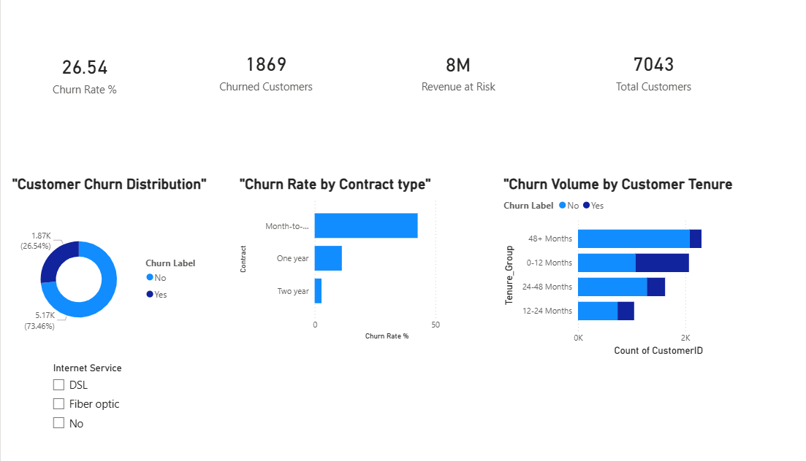
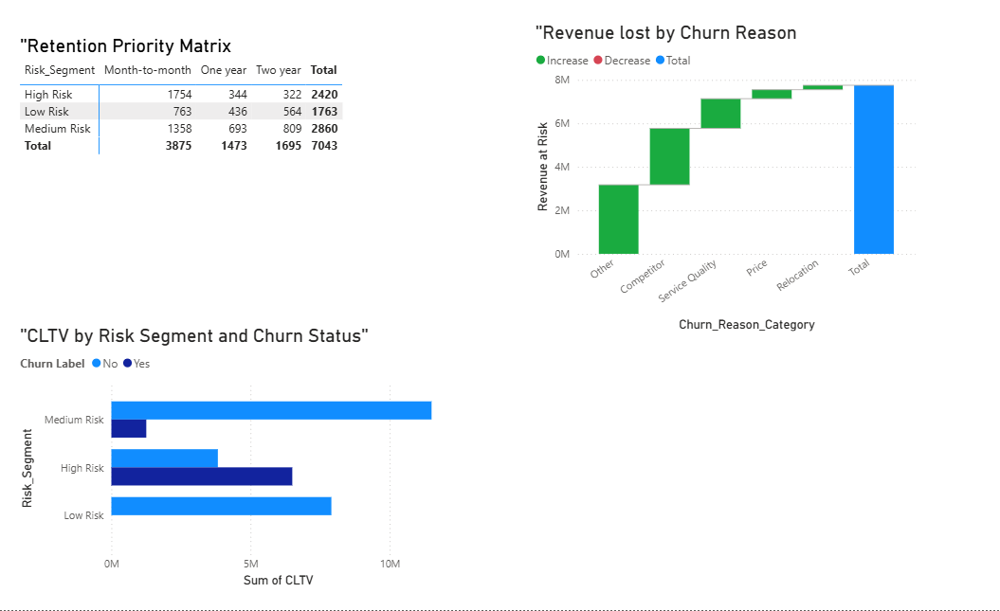
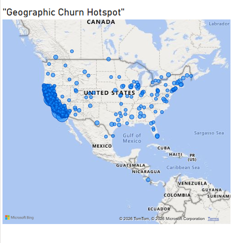

#  Telecom  Churn Analysis

### Tools:
Excel | SQL (SQLite) | Power BI | GitHub

---

##  Business Problem
A telecom company is losing **26.54%** of its customers.
**1,869 out of 7,043** customers have churned.
This project identifies **who** is churning, **why** they leave,
and **which customers** to prioritize for retention.

---

##  Dataset
- **Source:** IBM Telco Enhanced Dataset (Kaggle)
- **Rows:** 7,043 customers | **Columns:** 33
- **Churn Rate:** 26.54%
- **Special columns:** Churn Score (0-100), CLTV,
  Churn Reason, City/Location data

---

##  Business Questions Answered
1. What is the overall churn rate and revenue at risk?
2. Which contract type has the highest churn?
3. Which customers should we save first?
4. What are the top reasons customers are leaving?
5. Which cities have the highest churn?

---

##  Key Insights
-  **Revenue at Risk: $8M** in customer lifetime value lost
-  Month-to-month churn = **42%** vs Two-year = only **3%**
-  **#1 Churn Reason:** Attitude of support staff (192 customers)
-  New customers **(0-12 months)** = highest churn risk group
- Certain cities show much higher churn than others

---

##  Excel Analysis
- Cleaned raw data (7,043 rows, 33 columns)
- Added 6 helper columns:
  - Tenure_Group, Monthly_Charge_Band, Churn_Flag
  - Risk_Segment, Revenue_At_Risk, Churn_Reason_Category
- Built 3 Pivot Tables with Slicers

---

##  SQL Analysis ( 9 Queries)
- Overall churn rate = 26.54%
- Contract type breakdown (42% vs 11% vs 3%)
- Revenue at risk by risk segment
- Top 10 churn reasons
- Geographic churn hotspots by city
- Retention priority customer list (Top 20)

---

##  Power BI Dashboard (3 Pages)
- **Page 1:** Churn Overview — KPI cards, donut chart,
  bar chart, slicer
- **Page 2:** Risk & Revenue — Risk matrix,
  waterfall chart, scatter plot
- **Page 3:** Geography & Retention — Map visual,
  retention priority table, recommendations

---

##  Business Recommendations
1. Convert month-to-month customers to annual plans
   with **15% first-year discount**
2. Launch **tech support bundle** for Fiber optic customers
3. **Proactive outreach** to Top 20 high-value at-risk customers

---

##  Repository Structure
- `data/` — Cleaned Excel and CSV files
- `sql/` — All 9 SQL queries (churn_queries.sql)
- `powerbi/` — Power BI dashboard (.pbix file)
- `screenshots/` — All pivot, SQL and dashboard screenshots
- `README.md` — This file.
